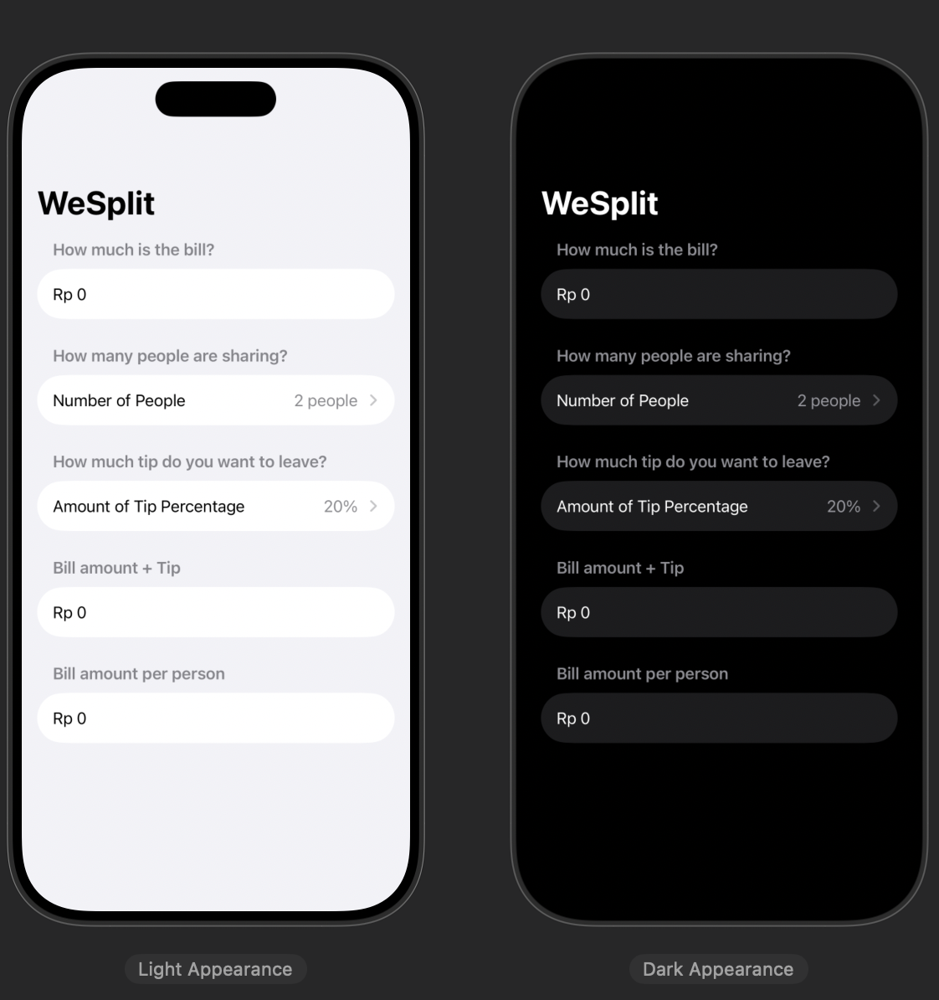
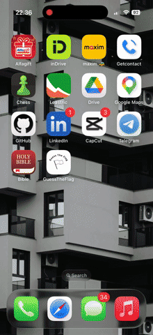

## My Hacking With Swift Projects 
### `A Learning Journey`

#### Project 1 | WeSplit
In this project i learn how to use @State and a little bit of User Experience Best Practice like adding some context before Section (Clarity).\
[Full Code Here](./SplitBill/)\
This is the final App.

#### Project 2 | Guess The Flag
In this project i gained hands-on experience with the following SwiftUI and programming concepts:
* **State Management:** Utilizing `@State` properties to track the user's score, question count, and game status, ensuring the UI stays synchronized with the data.
* **Asset Handling:** Managing image assets in Xcode and understanding that asset names are **case-sensitive** (e.g., "germany" vs "Germany").
* **Logic Branching:** Implementing `if-else` structures to toggle between per-round result alerts and a final "Game Over" alert.
* **Modular Functions:** Writing clean, reusable functions like `askQuestion()` for shuffling data and `resetGame()` to restore the initial state.
* **Modern UI Layout:** Designing an attractive interface using `RadialGradient` backgrounds and `Material` effects (blur) for a sleek, iOS-native feel.\

Game Rules:
1.  **Objective:** Players must identify and tap the correct flag of the country displayed on the screen.
2.  **Scoring:**
    * **Correct Answer:** Adds **+1 point** to the total score.
    * **Wrong Answer:** Displays an educational message (revealing which flag was actually tapped) and subtracts **1 point** (with a minimum floor of 0).
3.  **Duration:** Each game session consists of exactly **8 questions**.
4.  **Game Over:** After the 8th question, a final summary alert appears showing the player's total score out of 8, with an option to **Reset** and play again.

[Full Code Here](./GuessTheFlag/)\
This is the final App Recording.

